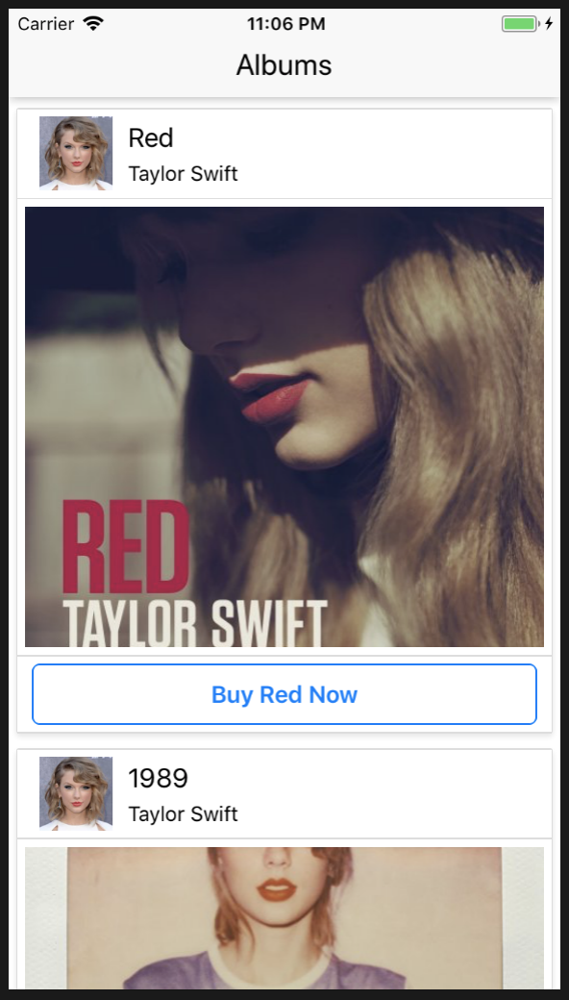
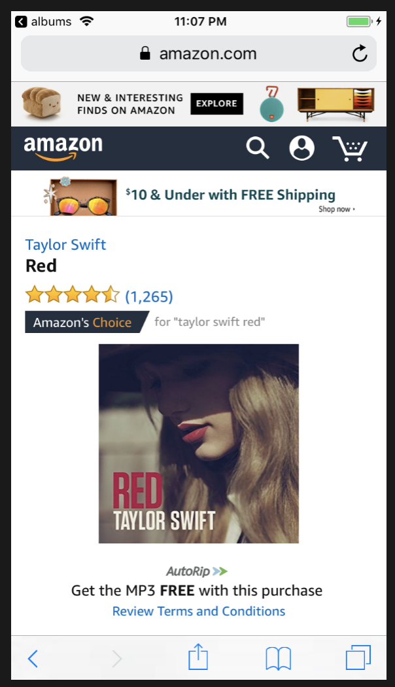

# react-native-album

This app was being built as part of my React Native self study.

This app uses Axios to pull album data via API and dynamically generates images and buttons. Upon button click, the user is redirected the Amazon site where the user can buy the album.

